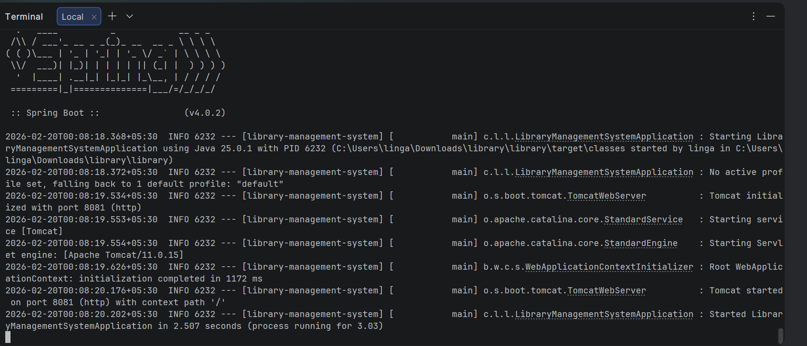
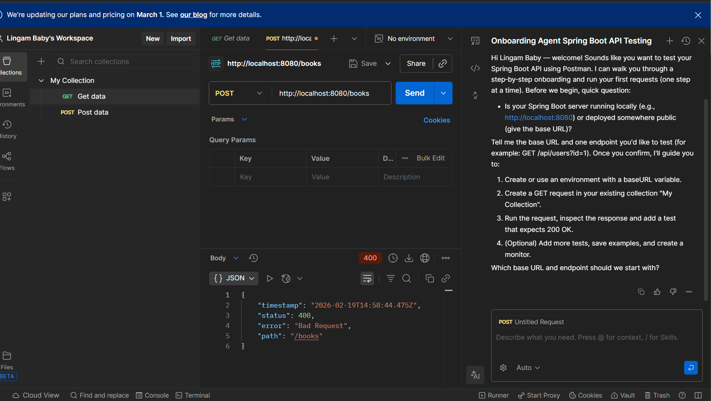

# 📚 Library Management System


A RESTful **Library Management System** built using Spring Boot.  
This project demonstrates layered architecture using Controllers, Services, Repositories, and Models with in-memory data storage.

---

## 🚀 Tech Stack

- Java 17  
- Spring Boot  
- Maven  
- REST APIs  
- In-memory Data Structures (List, Map, Set)  
- SLF4J / Logback  

---

## ✨ Features

### 📖 Book Management
- Add Book  
- Get All Books  
- Get Book By ID  
- Update Book  
- Delete Book  

### 👤 Patron Management
- Register Patron  
- View All Patrons  
- Update Patron  
- Delete Patron  

### 🔄 Lending System
- Borrow Book  
- Return Book  
- Reserve Book  

---

## 🏗 Project Structure

```
library-management-system
│── pom.xml
│── README.md
│── app-running.png
│── testingpostman.png
│
└── src/main/java/com/example/library
    ├── controller
    ├── service
    │   └── impl
    ├── repository
    ├── model
    └── LibraryManagementSystemApplication.java
```

---

## ▶️ How to Run the Project

### 1️⃣ Clone the Repository

```
git clone https://github.com/your-username/library-management-system.git
cd library-management-system
```

### 2️⃣ Run the Application

```
./mvnw spring-boot:run
```

Application will start at:

```
http://localhost:8080
```

---

## 🔌 API Endpoints

### 📖 Books

- GET `/books`
- GET `/books/{id}`
- POST `/books`
- PUT `/books/{id}`
- DELETE `/books/{id}`

### 👤 Patrons

- GET `/patrons`
- POST `/patrons`
- PUT `/patrons/{id}`
- DELETE `/patrons/{id}`

### 🔄 Lending

- POST `/lend/{bookId}/borrow/{patronId}`
- POST `/lend/{bookId}/return`
- POST `/lend/{bookId}/reserve/{patronId}`

---

## 📸 Screenshots

### 🖥 Application Running



---

### 📬 API Testing in Postman



---

## 🧠 Architecture

This project follows a **Layered Architecture**:

- Controller Layer – Handles HTTP requests  
- Service Layer – Business logic  
- Repository Layer – In-memory data handling  
- Model Layer – Entity classes  

---

## 👨‍💻 Author

Lingam Baby
GitHub:https://github.com/lingambaby/library-management-system
